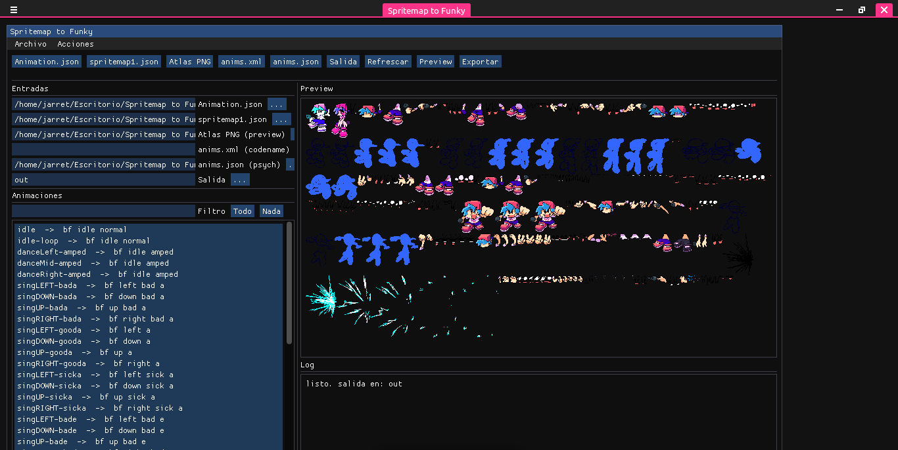
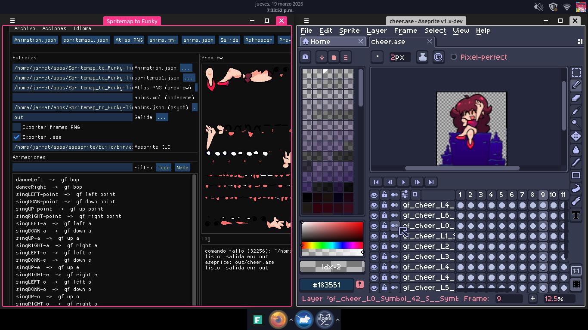

# How to Use Aseprite Extension (CLI)

This document explains how to configure and use the `.ase` output from the app.

## Preview





## 1) Aseprite CLI path
The **Aseprite CLI** field must point to the real Aseprite executable (console mode).

Example on Linux:
```
/home/jarret/apps/asesprite/build/bin/aseprite
```

Verify it exists and is executable:
```
ls -l /home/jarret/apps/asesprite/build/bin/
/home/jarret/apps/asesprite/build/bin/aseprite -v
```

If it is not executable:
```
chmod +x /home/jarret/apps/asesprite/build/bin/aseprite
```

## 2) Export only .ase (no PNG frames)
To avoid generating per-frame PNGs (slow):

1. Uncheck **Export PNG frames**.
2. Check **Export .ase**.
3. Click **Export**.

This generates only the final `.ase` file.

## 3) Where the .ase is saved
The `.ase` file is saved in the output folder you choose, named after the animation:

```
out/<anim_name>.ase
```

## 4) Errors and logs
If the export fails, a log is created next to the executable in:

```
logs/log_YYYYMMDD_HHMMSS.txt
```

The file contains the exact command that failed, for example:
```
comando fallo (32256): "/home/jarret/apps/asesprite/build/bin/aseprite" -b --script "out/cheer/_layers/_build_ase.lua"
```

## 5) Quick fix for "comando fallo (32256)"
Usually it means the executable path is wrong or not executable.

Check the **Aseprite CLI** field and use the real path (see section 1).
